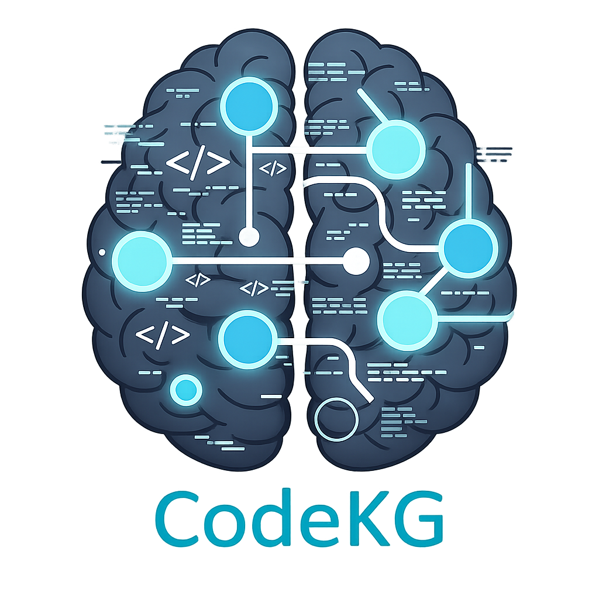

[](https://www.python.org/)
[](https://www.elastic.co/licensing/elastic-license)
[](https://github.com/Flux-Frontiers/code_kg/releases)
[](https://github.com/Flux-Frontiers/code_kg/actions/workflows/ci.yml)
[](https://python-poetry.org/)

<p align="center">
  
</p>

**CodeKG** — A Deterministic Knowledge Graph for Python Codebases
with Semantic Indexing and Source-Grounded Snippet Packing

*Author: Eric G. Suchanek, PhD*

*Flux-Frontiers, Liberty TWP, OH*

[Technical Paper (PDF)](docs/code_kg.pdf)

---

## Overview

CodeKG constructs a **deterministic, explainable knowledge graph** from a Python codebase using static analysis. The graph captures structural relationships — definitions, calls, imports, and inheritance — directly from the Python AST, stores them in SQLite, and augments retrieval with vector embeddings via LanceDB.

Structure is treated as **ground truth**; semantic search is strictly an acceleration layer. The result is a searchable, auditable representation of a codebase that supports precise navigation, contextual snippet extraction, and downstream reasoning without hallucination — making it an ideal retrieval engine for LLMs and a practical foundation for **Knowledge-Graph RAG (KRAG)**, in contrast to embedding-only approaches such as Amplify and probabilistic graph methods such as Microsoft GraphRAG.

The system ships with a Python library, CLI tools, an interactive Streamlit web app, and an MCP server for AI agent integration.

---

## Motivation

As Python systems grow, basic architectural questions become difficult:

- Where is configuration actually defined?
- Which functions participate in connection setup and verification?
- How does behavior propagate through runtime logic?
- Where are specific services or APIs invoked, and in what context?

Text search and IDE symbol lookup are brittle. LLMs provide semantic intuition but are not source-grounded. CodeKG bridges this gap by constructing a first-principles representation of code structure and layering semantic retrieval on top — without surrendering determinism or provenance.

---

## Design Principles

1. **Structure is authoritative** — The AST-derived graph is the source of truth.
2. **Semantics accelerate, never decide** — Vector embeddings seed and rank retrieval but never invent structure.
3. **Everything is traceable** — Nodes and edges map to concrete files and line numbers.
4. **Determinism over heuristics** — Identical input yields identical output.
5. **Composable artifacts** — SQLite for structure, LanceDB for vectors, Markdown/JSON for consumption.

---

## Core Data Model

### Nodes

Nodes represent concrete program elements extracted from the source tree:

| Kind       | Description                                                    |
|------------|----------------------------------------------------------------|
| `module`   | Python source file                                             |
| `class`    | Class definition                                               |
| `function` | Top-level function                                             |
| `method`   | Class method                                                   |
| `symbol`   | Variables, parameters, and attributes extracted by the data-flow pass |

Each node stores a stable deterministic `id`, `kind`, `name`, `qualname`, `module_path`, `lineno`, `end_lineno`, and optional `docstring`. Nodes live in **SQLite**, which is canonical.

### Edges

Edges encode semantic relationships between nodes:

| Relation       | Meaning                                                   |
|----------------|-----------------------------------------------------------|
| `CONTAINS`     | Module → class/function                                   |
| `CALLS`        | Function/method → function/method                         |
| `IMPORTS`      | Module → module/symbol                                    |
| `INHERITS`     | Class → base class                                        |
| `RESOLVES_TO`  | `sym:` stub → first-party definition (post-build, enables cross-module fan-in) |
| `ATTR_ACCESS`  | Variable/symbol → accessed attribute (`obj.attr`)         |
| `READS`        | Variable read at an assignment right-hand side or call site |
| `WRITES`       | Variable written at an assignment target                  |

Edges may carry **evidence** (e.g., source line number and expression text), enabling call-site extraction and precise auditability:

```json
{
  "lineno": 586,
  "expr": "psql_path = _get_psql_path()"
}
```

---

## Build Pipeline

### Phase 1 — Static Analysis (AST → SQLite)

The repository is parsed using Python's `ast` module in three sequential passes over each file:

1. **Pass 1 — Structural extraction** — modules, classes, functions, and methods are identified and `CONTAINS`/`IMPORTS`/`INHERITS` edges are emitted.
2. **Pass 2 — Call graph** — call expressions are resolved to their targets and `CALLS` edges with source-line evidence are recorded.
3. **Pass 3 — Data-flow** — `CodeKGVisitor` walks each AST to emit `READS`, `WRITES`, and `ATTR_ACCESS` edges at the variable and attribute level. New `symbol` nodes are merged non-destructively alongside the structural nodes from Passes 1 and 2.

**Output:** a single SQLite database (`.codekg/graph.sqlite`) with `nodes` and `edges` tables.

4. **Post-build — Symbol resolution** — `resolve_symbols()` name-matches every `sym:` stub (imported/attribute-accessed call targets) against all first-party definitions and writes `RESOLVES_TO` edges, connecting callers in other modules to the function definitions they invoke. This step is idempotent and runs automatically after each build.

> This phase uses **no embeddings and no LLMs**.

### Phase 2 — Semantic Indexing (SQLite → LanceDB)

To support semantic retrieval, a subset of nodes (`module`, `class`, `function`, `method`) is selected for vector indexing. Embedding text is constructed from names and docstrings, embedded using `all-MiniLM-L6-v2` (384-dim, overridable via `CODEKG_MODEL`), and stored in **LanceDB**.

The vector index is **derived and disposable**; SQLite remains authoritative.

---

## Hybrid Query Model

Queries execute in two explicit phases:

1. **Semantic seeding** — A natural-language query is embedded and used to retrieve a small set of semantically similar nodes from the vector index. These nodes act as conceptual entry points.

2. **Structural expansion** — From the semantic seeds, the relational graph is expanded using selected edge types (`CONTAINS`, `CALLS`, `IMPORTS`, `INHERITS`). Expansion is bounded by hop count and records provenance (minimum hop distance and originating seed).

---

## Ranking and Deduplication

Retrieved nodes are ranked deterministically by:

1. Hop distance from seed
2. Seed embedding distance
3. Node kind priority: `function`/`method` > `class` > `module` > `symbol`

To prevent redundancy, nodes are deduplicated by file and source span. Overlapping spans within the same file are merged, and a per-file cap prevents large modules from dominating results.

---

## Snippet Packing

For retained nodes, CodeKG extracts **source-grounded definition snippets** using recorded `module_path`, `lineno`, and `end_lineno`. Bounded context windows are applied to ensure readability while preserving precision. These snippet packs are suitable for:

- Human review
- LLM ingestion (grounded, not hallucinated)
- Agent pipelines

---

## Caller Lookup (Fan-In)

CodeKG provides precise fan-in lookup via the `callers()` API and `callers` MCP tool. A naive reverse traversal of `CALLS` edges fails for imported functions: the AST visitor emits `CALLS → sym:Foo` stubs for calls whose targets cannot be resolved at walk time (imported names, attribute accesses), leaving the `fn:` definition nodes with zero incoming cross-module edges.

The `RESOLVES_TO` post-build step bridges this gap by name-matching every `sym:` stub to its first-party definition. The two-phase `callers_of()` lookup then combines:

1. **Direct reverse** — nodes with `CALLS → target` edges
2. **Stub reverse** — nodes with `CALLS → sym:Foo` where `sym:Foo RESOLVES_TO target`

Results are deduplicated and returned as node dicts. The `callers` MCP tool exposes this directly to agents:

```python
# Python API
callers = kg.callers("fn:src/auth/jwt.py:JWTValidator.validate")

# MCP tool
callers("fn:src/auth/jwt.py:JWTValidator.validate")
# → {"node_id": ..., "caller_count": 7, "callers": [...]}
```

---

## Call-Site Extraction

Beyond definitions, CodeKG extracts **call-site snippets** using evidence stored on `CALLS` edges. Small source windows around invocation sites are collected, deduplicated, and ranked. This enables precise answers to questions such as *where is this function used, and under what conditions?*

---

## End-to-End Workflow

```
Repository
  ↓
AST parsing — Pass 1: structure, Pass 2: calls, Pass 3: data-flow  (codekg.py + visitor.py)
  ↓
SQLite graph — nodes + edges  (build_codekg_sqlite.py)
  ↓
Symbol resolution — RESOLVES_TO edges (sym: stubs → fn:/cls: defs)  (store.py)
  ↓
Vector indexing — LanceDB  (build_codekg_lancedb.py)
  ↓
Hybrid query — semantic + graph  (codekg_query.py)
  ↓
Ranking + deduplication
  ↓
Snippet pack — Markdown / JSON  (codekg_snippet_packer.py)
  ↓
  ├──▶  Streamlit web app  (app.py / codekg-viz)
  └──▶  MCP server tools   (codekg-mcp)
```

---

## Installation

**Requirements:** Python ≥ 3.10, < 3.13

### Standalone (pip)

```bash
pip install 'code-kg[mcp] @ git+https://github.com/Flux-Frontiers/code_kg.git'
```

### Existing Poetry project

Add `code-kg` as a dev dependency from GitHub:

```bash
poetry add --group dev 'code-kg[mcp] @ git+https://github.com/Flux-Frontiers/code_kg.git'
```

All CLI entry points (`codekg-mcp`, `codekg-build-sqlite`, `codekg-build-lancedb`, etc.) are available immediately via `poetry run` — no changes to your own `pyproject.toml` required:

```bash
poetry run codekg-build-sqlite --repo . --db .codekg/graph.sqlite
poetry run codekg-build-lancedb --sqlite .codekg/graph.sqlite --lancedb .codekg/lancedb
poetry run codekg-mcp --repo . --db .codekg/graph.sqlite --lancedb .codekg/lancedb
```

---

## Quick Start

The fastest way to integrate CodeKG into any Python repository — run the one-line installer from within the repo you want to index:

```bash
curl -fsSL https://raw.githubusercontent.com/Flux-Frontiers/code_kg/main/scripts/install-skill.sh | bash
```

The installer sets up the full **AI integration layer** end-to-end:

1. Installs `SKILL.md` reference files for Claude Code, Kilo Code, and other agents
2. Installs the `/codekg` slash command for Cline
3. Installs the `code-kg` package if not already present — prefers the latest GitHub release wheel (`pip install 'code-kg[mcp] @ <wheel-url>'`), falls back to `pip install 'code-kg[mcp] @ git+https://github.com/Flux-Frontiers/code_kg.git'`
4. Builds the SQLite knowledge graph (`.codekg/graph.sqlite`) and LanceDB semantic index
5. Writes MCP configuration for each provider:
   - `.mcp.json` — Claude Code and Kilo Code
   - `.vscode/mcp.json` — GitHub Copilot

By default all providers are configured. Pass `--providers` to target specific ones, or `--dry-run` to preview what the script would do without making any changes:

```bash
# All providers (default)
curl -fsSL .../install-skill.sh | bash -s -- --providers all

# Claude Code and GitHub Copilot only
curl -fsSL .../install-skill.sh | bash -s -- --providers claude,copilot

# Preview without making changes
curl -fsSL .../install-skill.sh | bash -s -- --dry-run

# Available provider names: claude, kilo, copilot, cline
```

After the script completes, reload VS Code (`Cmd+Shift+P` → `Developer: Reload Window`) to activate the MCP server. GitHub Copilot will prompt you to **Trust** the server on first use.

---

## CLI Usage

Once installed, all commands are available via the `python -m code_kg` dispatcher:

```bash
python -m code_kg --help
```

### 1. Build the SQLite knowledge graph

```bash
python -m code_kg build-sqlite --repo /path/to/repo --db .codekg/graph.sqlite [--wipe]
```

### 2. Build the LanceDB semantic index

```bash
python -m code_kg build-lancedb --sqlite .codekg/graph.sqlite --lancedb .codekg/lancedb [--model all-MiniLM-L6-v2] [--wipe]
```

### 3. Run a hybrid query

```bash
python -m code_kg query \
  --sqlite .codekg/graph.sqlite \
  --lancedb .codekg/lancedb \
  --q "database connection setup" \
  --k 8 \
  --hop 1
```

### 4. Generate a snippet pack

```bash
python -m code_kg pack \
  --repo-root /path/to/repo \
  --sqlite .codekg/graph.sqlite \
  --lancedb .codekg/lancedb \
  --q "configuration loading" \
  --k 8 \
  --hop 1 \
  --format md \
  --out context_pack.md
```

**Key options for `pack`:**

| Option             | Default                          | Description                              |
|--------------------|----------------------------------|------------------------------------------|
| `--k`              | `8`                              | Top-K semantic hits                      |
| `--hop`            | `1`                              | Graph expansion hops                     |
| `--rels`           | `CONTAINS,CALLS,IMPORTS,INHERITS`| Edge types to expand                     |
| `--context`        | `5`                              | Extra context lines around each span     |
| `--max-lines`      | `160`                            | Max lines per snippet block              |
| `--max-nodes`      | `50`                             | Max nodes returned in pack               |
| `--format`         | `md`                             | Output format: `md` or `json`            |
| `--include-symbols`| off                              | Include symbol nodes in output           |

### 5. Launch the Streamlit visualizer

```bash
python -m code_kg viz [--db .codekg/graph.sqlite] [--port 8500]
```

### 6. Start the MCP server

```bash
python -m code_kg mcp \
  --repo    /path/to/repo \
  --db      /path/to/repo/.codekg/graph.sqlite \
  --lancedb /path/to/repo/.codekg/lancedb
```

---

## Streamlit Web Application

CodeKG ships an interactive knowledge-graph explorer built with Streamlit and pyvis.

```bash
poetry run codekg-viz
```

The app provides three tabs:

| Tab | Description |
|---|---|
| **🗺️ Graph Browser** | Interactive pyvis graph; filter by node kind or module path; click nodes for rich detail panels with docstrings and edges |
| **🔍 Hybrid Query** | Natural-language query → ranked nodes with graph, table, edge, and JSON views; download results |
| **📦 Snippet Pack** | Query → source-grounded code snippets; download as Markdown or JSON |

The sidebar provides one-click **Build Graph**, **Build Index**, and **Build All** buttons so you can index a new codebase without leaving the browser.

---

## MCP Server

CodeKG ships a built-in **Model Context Protocol (MCP) server** that exposes the full query pipeline as structured tools for any MCP-compatible AI agent — Claude Code, Kilo Code, GitHub Copilot, Claude Desktop, Cursor, Continue, or any custom agent.

### Prerequisites

Build the knowledge graph first (the MCP server is read-only):

```bash
poetry run codekg-build-sqlite  --repo /path/to/repo --db .codekg/graph.sqlite
poetry run codekg-build-lancedb --sqlite .codekg/graph.sqlite --lancedb .codekg/lancedb
```

> **Note:** `codekg-build-lancedb` uses `--sqlite`, not `--db`.

Install the optional `mcp` dependency:

```bash
poetry install --extras mcp
```

### Available Tools

| Tool | Description |
|---|---|
| `query_codebase(q, ...)` | Hybrid semantic + structural query; returns ranked nodes and edges as JSON |
| `pack_snippets(q, ...)` | Hybrid query + source-grounded snippet extraction; returns Markdown |
| `get_node(node_id)` | Fetch a single node by its stable ID |
| `graph_stats()` | Node and edge counts by kind/relation |
| `callers(node_id)` | Precise fan-in lookup resolving cross-module `sym:` stubs via `RESOLVES_TO` edges |

### Automated setup

The Quick Start installer (`curl ... | bash`) writes all MCP config files automatically for every supported provider. The sections below show the generated format for reference, or for manual setup if you prefer not to use the installer.

Alternatively, from inside Claude Code run:

```
/setup-mcp [/path/to/repo]
```

This skill verifies installation, builds the graph and index, smoke-tests the pipeline, and writes/updates the config files, reporting a node/edge/vector summary when done.

See [`docs/MCP.md`](docs/MCP.md) for the full MCP reference including tool schemas, query strategy guide, and troubleshooting.

### Claude Desktop (manual)

Add a `codekg` entry to `claude_desktop_config.json`
(macOS: `~/Library/Application Support/Claude/claude_desktop_config.json`):

```json
{
  "mcpServers": {
    "codekg": {
      "command": "codekg-mcp",
      "args": [
        "--repo",    "/absolute/path/to/repo",
        "--db",      "/absolute/path/to/repo/.codekg/graph.sqlite",
        "--lancedb", "/absolute/path/to/repo/.codekg/lancedb"
      ]
    }
  }
}
```

Use **absolute paths** — Claude Desktop does not inherit your shell's working directory. Restart Claude Desktop after editing the config.

### Claude Code / Kilo Code — `.mcp.json` (manual)

Both Claude Code and Kilo Code read per-repo config from `.mcp.json`. Point `command` directly at the `codekg-mcp` binary inside the virtual environment:

```json
{
  "mcpServers": {
    "codekg": {
      "command": "/absolute/path/to/.venv/bin/codekg-mcp",
      "args": [
        "--repo",    "/absolute/path/to/repo",
        "--db",      "/absolute/path/to/repo/.codekg/graph.sqlite",
        "--lancedb", "/absolute/path/to/repo/.codekg/lancedb"
      ]
    }
  }
}
```

> ⚠️ Use per-repo `.mcp.json` only — do NOT add `codekg` to any global settings file.

### GitHub Copilot — `.vscode/mcp.json` (manual)

GitHub Copilot uses `.vscode/mcp.json` with a different schema (`"servers"` key, `"type": "stdio"` required). Each flag and value must be a separate element in `args`:

```json
{
  "servers": {
    "codekg": {
      "type": "stdio",
      "command": "/absolute/path/to/.venv/bin/codekg-mcp",
      "args": [
        "--repo",
        "/absolute/path/to/repo",
        "--db",
        "/absolute/path/to/repo/.codekg/graph.sqlite",
        "--lancedb",
        "/absolute/path/to/repo/.codekg/lancedb"
      ]
    }
  }
}
```

VS Code will prompt you to **Trust** the server on first use.

---

## Output Artifacts

| Artifact             | Description                                      |
|----------------------|--------------------------------------------------|
| `.codekg/graph.sqlite` | Canonical knowledge graph (nodes + edges)      |
| `.codekg/lancedb/`    | Derived semantic vector index                  |
| Markdown        | Human-readable context packs with line numbers |
| JSON            | Structured payload for agent/LLM ingestion     |

---

## Project Structure

```
code_kg/
├── CHANGELOG.md
├── CLAUDE.md
├── LICENSE
├── README.md
├── release-notes.md
├── pyproject.toml
├── docs/
│   ├── Architecture.md
│   ├── CHEATSHEET.md
│   ├── code_kg.pdf
│   ├── code_kg_workflow.md
│   ├── deployment.md
│   ├── MCP.md
│   └── logo.png
├── lib/
│   ├── bindings/
│   │   └── utils.js
│   ├── tom-select/
│   │   ├── tom-select.complete.min.js
│   │   └── tom-select.css
│   └── vis-9.1.2/
│       ├── vis-network.css
│       └── vis-network.min.js
├── scripts/
│   └── install-skill.sh
├── src/
│   └── code_kg/
│       ├── __init__.py
│       ├── app.py
│       ├── build_codekg_lancedb.py
│       ├── build_codekg_sqlite.py
│       ├── codekg.py
│       ├── codekg_query.py
│       ├── codekg_snippet_packer.py
│       ├── codekg_viz.py
│       ├── graph.py
│       ├── index.py
│       ├── kg.py
│       ├── mcp_server.py
│       ├── store.py
│       └── visitor.py
├── tests/
│   ├── test_graph.py
│   ├── test_kg.py
│   ├── test_primitives.py
│   └── test_store.py
└── __pycache__/
```

---

## Development

To work on CodeKG itself, clone the repository and install in editable mode with dev dependencies:

```bash
git clone https://github.com/Flux-Frontiers/code_kg.git
cd code_kg
poetry install --extras mcp
```

Run the test suite:

```bash
poetry run pytest
```

---

## License

[Elastic License 2.0](https://www.elastic.co/licensing/elastic-license) — see [LICENSE](LICENSE).

Free to use, modify, and distribute. You may not offer the software as a hosted or managed service to third parties. Commercial use internally is permitted.
